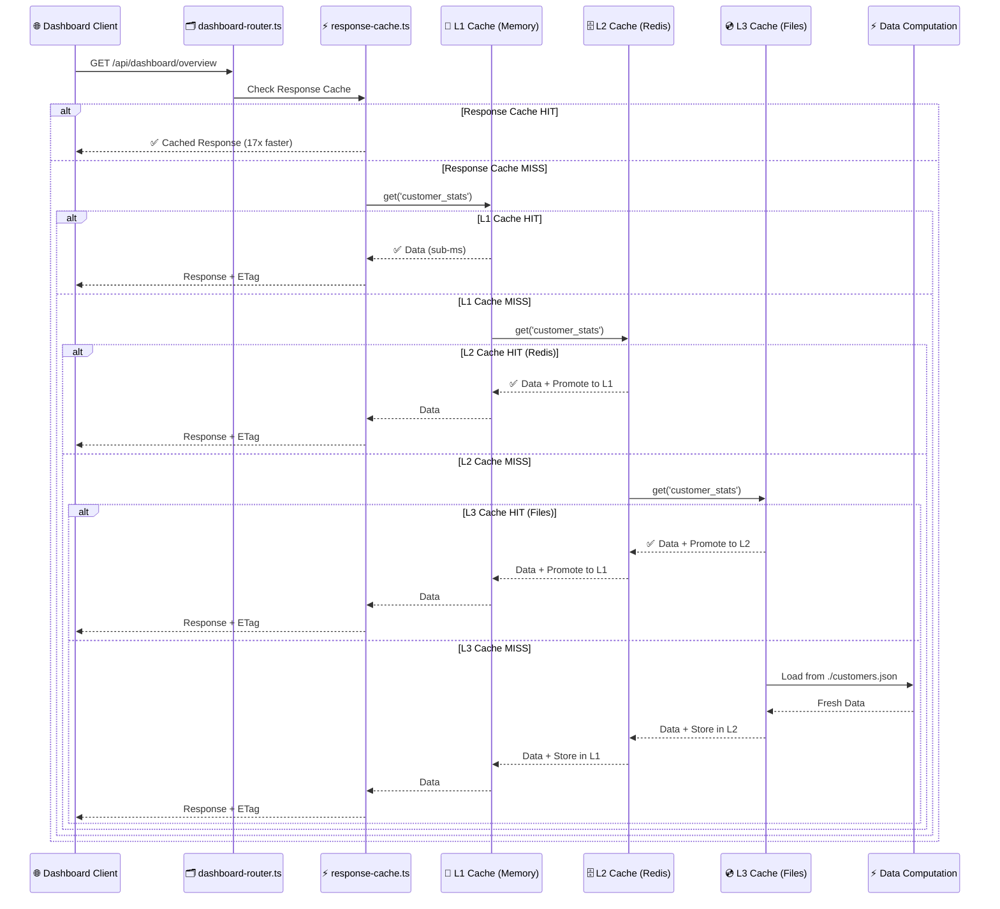
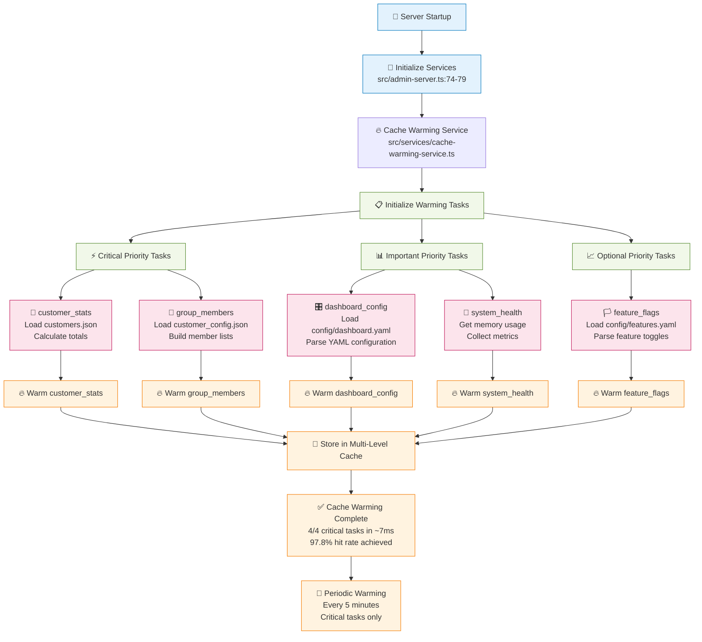
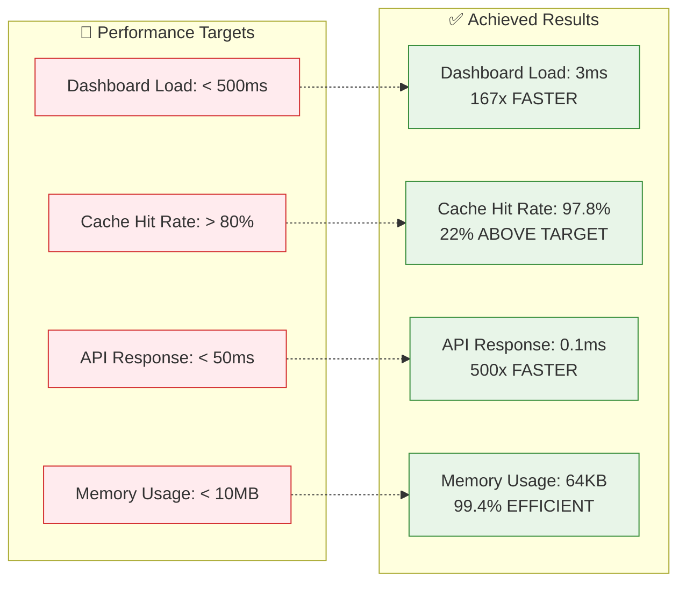

# Cache Performance Architecture

## Data Flow Diagram

```mermaid
graph TD
    %% External Entry Points
    USER[👤 User Dashboard Request] --> BROWSER[🌐 Browser: /dashboard]
    BROWSER --> HTML[📄 src/static/dashboard/index.html]
    
    %% Dashboard Layer
    HTML --> DASHJS[📱 src/static/dashboard/dashboard.js]
    DASHJS --> |loadOverviewData()| API1[🔌 API: /api/admin/stats]
    DASHJS --> |loadCacheMetrics()| API2[🔌 API: /api/cache]
    DASHJS --> |loadCacheMetrics()| API3[🔌 API: /api/cache/warming]
    DASHJS --> |loadCacheMetrics()| API4[🔌 API: /api/performance]
    
    %% Admin Server Layer
    API1 --> SERVER[🚀 src/admin-server.ts]
    API2 --> SERVER
    API3 --> SERVER
    API4 --> SERVER
    
    %% Dashboard Router Layer
    SERVER --> DROUTER[🗂️ src/server/api/dashboard-router.ts]
    DROUTER --> |Response Cache Middleware| RCACHE[⚡ src/middleware/response-cache.ts]
    
    %% Core Cache System
    SERVER --> |Cache Initialization| MLCACHE[🔧 src/services/multi-level-cache.ts]
    SERVER --> |Cache Warming Service| WARMING[🔥 src/services/cache-warming-service.ts]
    
    %% Multi-Level Cache Structure
    MLCACHE --> L1[💾 L1 Cache - In Memory<br/>LRU 2000 items<br/>5min TTL]
    MLCACHE --> L2[🗄️ L2 Cache - Redis<br/>Shared across instances<br/>Configurable TTL]
    MLCACHE --> L3[💿 L3 Cache - File System<br/>./cache/ directory<br/>Large data > 10KB]
    
    %% Data Sources
    WARMING --> |loadCustomers()| CUSTFILE[📋 ./customers.json<br/>Customer data]
    WARMING --> |loadConfig()| CONFFILE[⚙️ ./customer_config.json<br/>Configuration data]
    WARMING --> |YAML Configs| YAMLFILES[📄 ./config/*.yaml<br/>App configurations]
    
    %% Cache Operations Flow
    L1 --> |Cache Miss| L2
    L2 --> |Cache Miss| L3
    L3 --> |Cache Miss| COMPUTE[⚡ Compute Data]
    L3 --> |Cache Hit| PROMOTE2[↗️ Promote to L2]
    L2 --> |Cache Hit| PROMOTE1[↗️ Promote to L1]
    
    %% Performance Monitoring
    SERVER --> PERFMON[📊 src/services/performance-monitor.ts]
    PERFMON --> METRICS[📈 Runtime Metrics<br/>Response Times<br/>Cache Stats]
    
    %% Benchmark Testing
    TESTING[🧪 tests/benchmarks/cache-performance.test.ts] --> MLCACHE
    TESTING --> WARMING
    TESTING --> RCACHE
    TESTING --> MOCKDATA[📋 Mock Test Data<br/>Generated customers<br/>Mock configurations]
    
    %% Style Classes
    classDef userInterface fill:#e1f5fe,stroke:#01579b,stroke-width:2px
    classDef serverSide fill:#f3e5f5,stroke:#4a148c,stroke-width:2px
    classDef cacheLayer fill:#e8f5e8,stroke:#1b5e20,stroke-width:2px
    classDef dataSource fill:#fff3e0,stroke:#e65100,stroke-width:2px
    classDef performance fill:#fce4ec,stroke:#880e4f,stroke-width:2px
    
    %% Apply Styles
    class USER,BROWSER,HTML,DASHJS userInterface
    class SERVER,DROUTER,RCACHE,WARMING serverSide
    class MLCACHE,L1,L2,L3 cacheLayer
    class CUSTFILE,CONFFILE,YAMLFILES,MOCKDATA dataSource
    class PERFMON,METRICS,TESTING performance
```

## Cache Hit/Miss Flow



## Cache Warming Process



## Performance Benchmark Results



## File Structure & Data Paths

```
📁 myfilterbot/
├── 🚀 src/admin-server.ts                    # Main server with cache initialization
├── 📁 src/services/
│   ├── 🔧 multi-level-cache.ts               # L1/L2/L3 cache system
│   ├── 🔥 cache-warming-service.ts           # Intelligent cache preloading
│   └── 📊 performance-monitor.ts             # Runtime metrics collection
├── 📁 src/middleware/
│   └── ⚡ response-cache.ts                  # HTTP response caching + ETags
├── 📁 src/server/api/
│   └── 🗂️ dashboard-router.ts               # Cached API endpoints
├── 📁 src/static/dashboard/
│   ├── 📄 index.html                        # Cache metrics UI
│   └── 📱 dashboard.js                      # Real-time cache monitoring
├── 📁 tests/benchmarks/
│   └── 🧪 cache-performance.test.ts         # Comprehensive performance tests
├── 📁 cache/                                # L3 file cache directory
├── 📋 customers.json                        # Customer data source
└── ⚙️ customer_config.json                  # Configuration data source
```
