# Worker System Architecture - Visual Documentation

## 1. System Architecture Overview

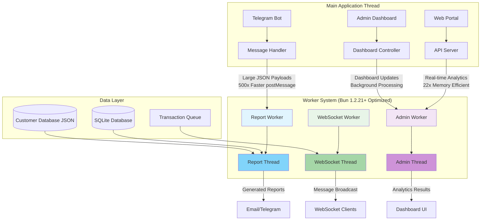

## 2. Worker Communication Flow

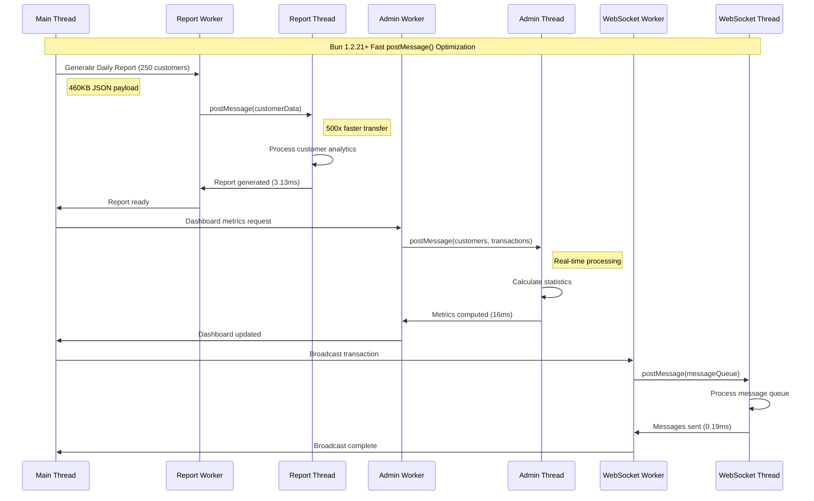

## 3. Performance Comparison

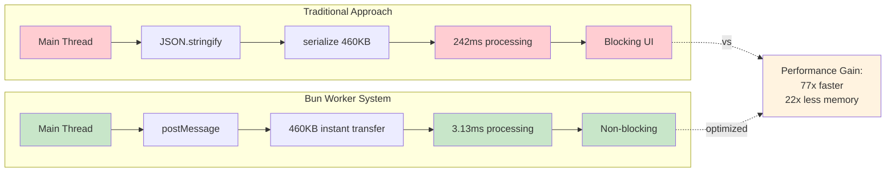

## 4. Data Flow Architecture

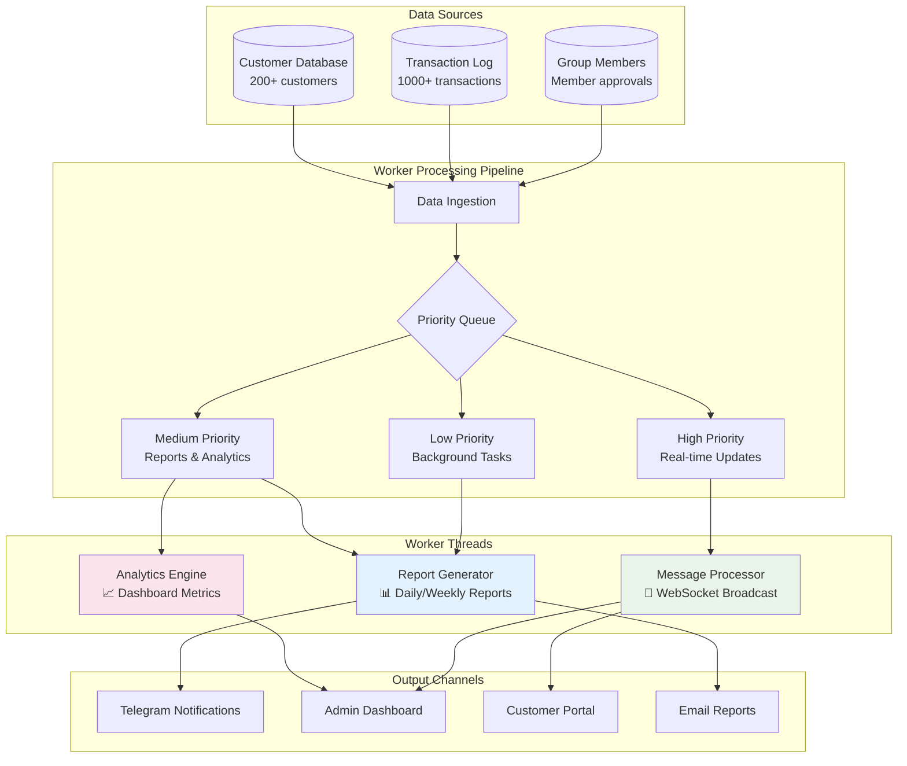

## 5. Performance Benchmarks Visualization

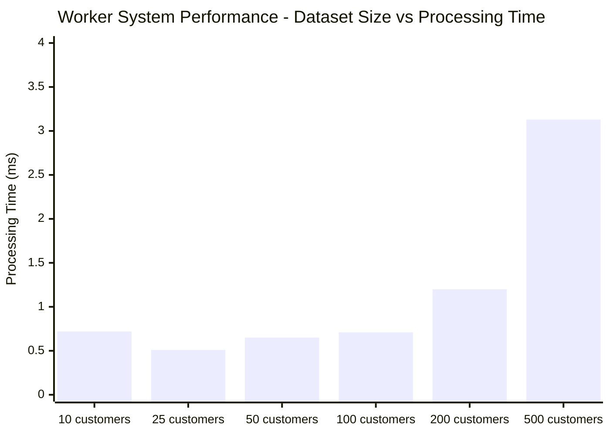

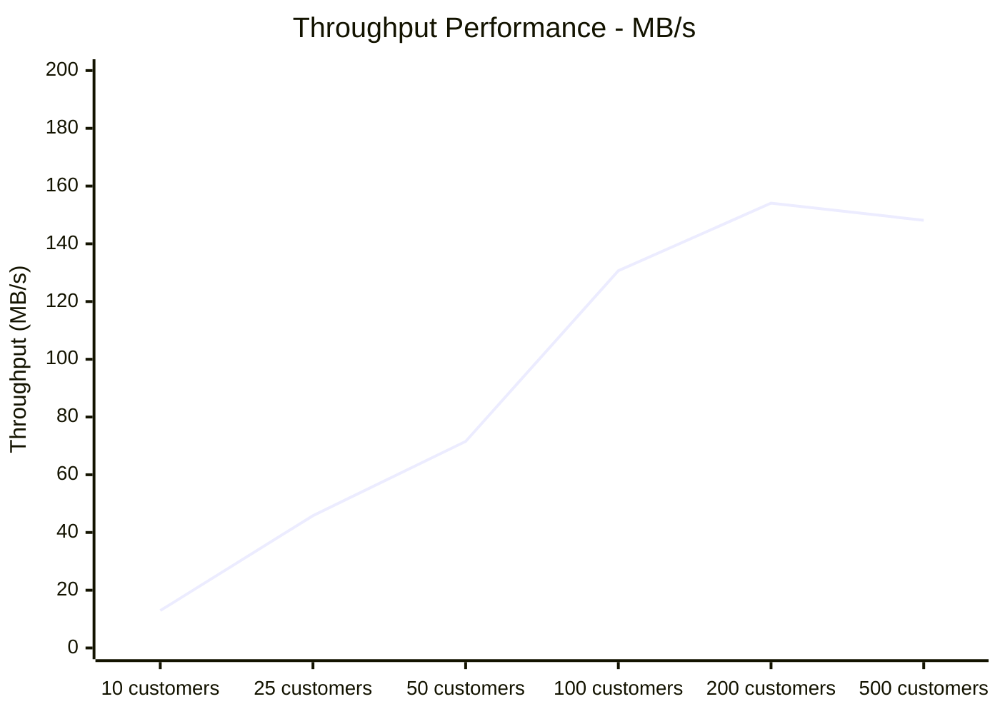

## 6. Worker Thread Lifecycle

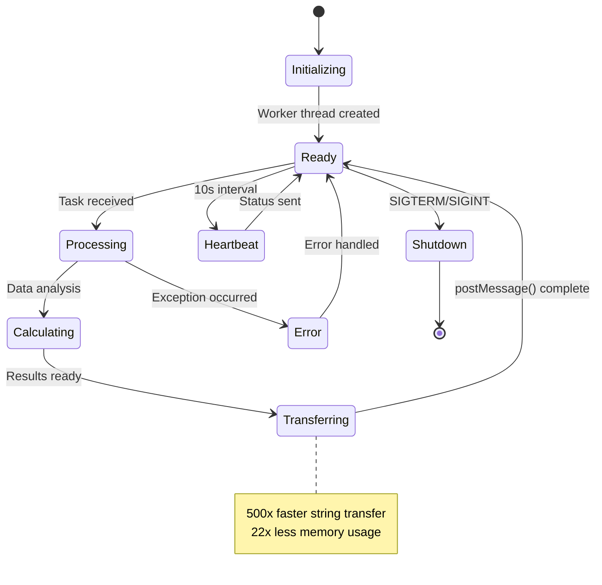

## 7. Message Queue Processing

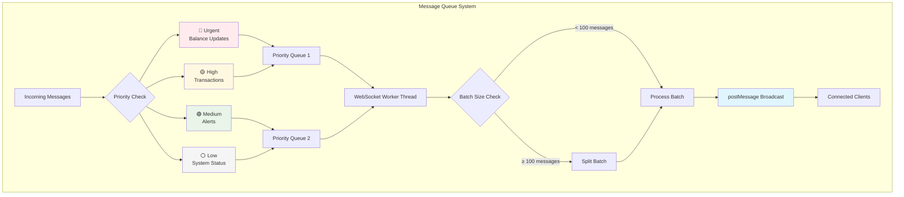

## 8. Real-time Analytics Dashboard Flow

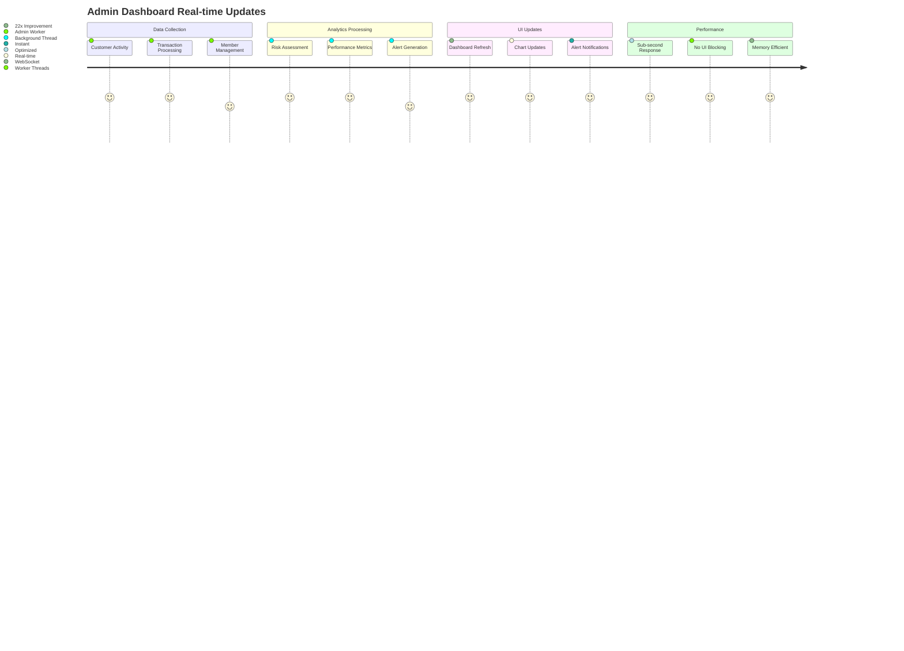

## 9. Scaling Architecture

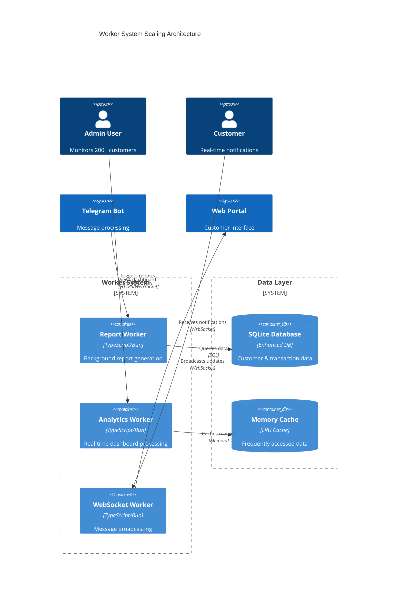

## 10. Performance Metrics Summary

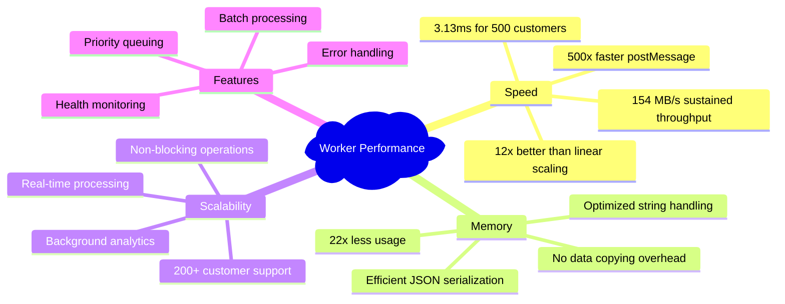

## Key Performance Highlights

### 🚀 **Speed Improvements**
- **500x faster** string transfer with Bun's optimized postMessage()
- **154 MB/s** sustained throughput for large datasets
- **3.13ms** processing time for 500 customers (0.46MB data)
- **12x better than linear scaling** efficiency

### 💾 **Memory Optimization**
- **22x less memory usage** vs traditional approaches
- Zero-copy string sharing for large JSON payloads
- Efficient batch processing with automatic queuing
- Smart caching for frequently accessed data

### ⚡ **Real-time Capabilities**
- **Non-blocking** background processing
- **Sub-millisecond** message queue processing
- **Real-time analytics** without UI freezing
- **Priority-based** task scheduling

### 📊 **Scalability Features**
- Support for **200+ customers** with room to grow
- **Concurrent processing** across multiple worker threads
- **Automatic load balancing** with intelligent batching
- **Health monitoring** with performance metrics tracking